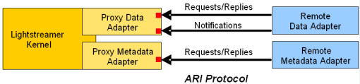

# Lightstreamer - "Hello World" Tutorial - Python Adapter #
<!-- START DESCRIPTION lightstreamer-example-helloworld-adapter-python -->

The "Hello World" Tutorial is a very basic example, based on Lightstreamer, where we push the alternated strings "Hello" and "World", followed by the current timestamp, from the server to the browser.

This project, of the "Hello World with Lightstreamer" series, will focus on a [PHP](http://www.php.net/) port of the Java Adapter illustrated in [Lightstreamer - "Hello World" Tutorial - Java Adapter](https://github.com/Lightstreamer/Lightstreamer-example-HelloWorld-adapter-java).

As an example of [Clients Using This Adapter](https://github.com/Lightstreamer/Lightstreamer-example-HelloWorld-adapter-php#clients-using-this-adapter), you may refer to the [Lightstreamer - "Hello World" Tutorial - HTML Client](https://github.com/Lightstreamer/Lightstreamer-example-HelloWorld-client-javascript) and view the corresponding [Live Demo](http://demos.lightstreamer.com/HelloWorld/).

## Details

First, please take a look at the previous installment [Lightstreamer - "Hello World" Tutorial - HTML Client](https://github.com/Lightstreamer/Lightstreamer-example-HelloWorld-client-javascript), which provides some background and the general description of the application. Notice that the front-end will be exactly the same. We created a very simple HTML page that subscribes to the "greetings" item, using the "HELLOWORLD" Adapter. Now, we will replace the "HELLOWORLD" Adapter implementation based on Java with a Python equivalent. On the client side, nothing will change, as server-side Adapters can be transparently switched and changed, as long as they respect the same interfaces. Thanks to this decoupling, provided by Lightstreamer Server, we could even do something different. For example, we could keep the Java Adapter on the server side and use Flex, instead of HTML, on the client side. Or, we could use the Python Adapter on the server side and use Java, instead of HMTL or Flex, on the client side. Basically, all the combinations of languages and technologies on the client side and on the server side are supported.

Please refer to [General Concepts](http://www.lightstreamer.com/docs/base/General%20Concepts.pdf) for more details about Lightstreamer Adapters.

### Python Interfaces

Lightstreamer Server exposes native Java Adapter interfaces. The Python interfaces are added through the ***Lightstreamer Adapter Remoting Infrastructure (ARI)***. Let's have a look at it.



ARI is simply made up of two Proxy Adapters and a **Network Protocol**. The two Proxy Adapters implement the Java interfaces and are meant to be plugged into Lightstreamer Kernel, exactly as we did for our original "HELLOWORLD" Java Adapter. There are two Proxy Adapters because one implements the Data Adapter interface and the other implements the Metadata Adapter interface. Our "Hello World" example uses a default Metadata Adapter, so we only need the **Proxy Data Adapter**.

Basically, the Proxy Data Adapter exposes the Data Adapter interface through TCP sockets. In other words, it offers a Network Protocol, which any remote counterpart can implement to behave as a Lightstreamer Data Adapter. This means you can write a remote Data Adapter in any language, provided that you have access to plain TCP sockets. 
But, if your remote Data Adapter is based on certain languages/technologies (such as Java, .NET, and Node.js), you can forget about direct socket programming, and leverage a ready-made library that exposes a higher level interface. Now, you will simply have to implement this higher level interface.<br>
So the Proxy Data Adapter converts from a Java interface to TCP sockets, and the API library converts from TCP sockets to higher level interface.

You may find more details about ARI in [Adapter Remoting Infrastructure Network Protocol Specification](http://www.lightstreamer.com/docs/adapter_generic_base/ARI%20Protocol.pdf).

<!-- END DESCRIPTION lightstreamer-example-helloworld-adapter-php -->

### Dig the Code

#### The Python Data Adapter
All the required Python code is provided by the `helloworld.py` module.

First, we import the classes included in the `lightstreamer-adapter` subpackages, required to the communicate with the Proxy Adapters:

```python
from lightstreamer_adapter.interfaces.data import DataProvider
from lightstreamer_adapter.server import DataProviderServer
```

The *HelloWorldDataAdapter* extends *DataProvider* abstract class, which is a Python equivalent of the Java DataProvider interface, 
provided by the Lightstreamer SDK for Python Adapters: 

```python
class HelloWorldDataAdapter(DataProvider):

    def __init__(self):
        self.greetings = None
        self.executing = threading.Event()
        self.listener = None

    def initialize(self, parameters, config_file=None):
        pass

    def run(self):
        random.seed()
        counter = 0
        while not self.executing.is_set():
            events = {'message': 'Hello' if counter % 2 == 0 else 'World',
                      'timestamp': time.strftime('%a, %d %b %Y %H:%I:%M:%S')}
            counter += 1
            self.listener.update('greetings', events, False)
            time.sleep(random.uniform(1, 2))

    def set_listener(self, event_listener):
        self.listener = event_listener

    def subscribe(self, item_name):
        if item_name == 'greetings':
            self.greetings = threading.Thread(target=self.run,
                                              name='greetings')
            self.greetings.start()

    def unsubscribe(self, item_name):
        if item_name == 'greetings':
            self.executing.clear()
            self.greetings.join()

    def issnapshot_available(self, item_name):
        return False
```
The Adapter's subscribe method is invoked when a new item is subscribed for the first time. When the "greetings" item is subscribed by the first user, the `greetings` thread is started and begins to generate the real-time data. If more users subscribe to the "greetings" item, the subscribe method is no longer invoked. When the last user unsubscribes from this item, the Adapter is notified through the unsubscribe invocation. In this case, the `greetings` thread is terminated  and no more events are published  for that item. If a new user re-subscribes to "greetings", the subscribe method is invoked again ad the process resumes the same way.

The final part of the script initializes and activates the communication with the Proxy Adapters:

```python
def main():
    address = ("localhost", 6661, 6662)
    data_adapter = HelloWorldDataAdapter()
    dataprovider_server = DataProviderServer(data_adapter, address)
    dataprovider_server.start()


if __name__ == "__main__":
    main()
```
First, we create and start the *GreetingThread*. First, we instantiate the *HelloWordDataAdaper*, passing the handle to the GreetingsThread. After that, we create a *DataProviderServer* instance (which is the Python equivalent of the Java DataProviderServer and extends the Server abstract class defined above) and assign the HelloWorldAdapter instance to it.
Since the Proxy Data Adapter to which our remote PHP Adapter will connect needs two connections, we create and setup the StarterServer with two different TPC ports (6661 and 6662 as configured in the beginning ) in order to make it create two stream sockets. Finally, we start DataProviderServer.

#### The Adapter Set Configuration

This Adapter Set is configured and will be referenced by the clients as `PYTHON_HELLOWORLD`.
For this demo, we configure just the Data Adapter as a *Proxy Data Adapter*, while instead, as Metadata Adapter, we use the [LiteralBasedProvider](https://github.com/Lightstreamer/Lightstreamer-example-ReusableMetadata-adapter-java), a simple full implementation of a Metadata Adapter, already provided by Lightstreamer server.
As *Proxy Data Adapter*, you may configure also the robust versions. The *Robust Proxy Data Adapter* has some recovery capabilities and avoid to terminate the Lightstreamer Server process, so it can handle the case in which a Remote Data Adapter is missing or fails, by suspending the data flow and trying to connect to a new Remote Data Adapter instance. Full details on the recovery behavior of the Robust Data Adapter are available as inline comments within the `DOCS-SDKs/adapter_remoting_infrastructure/doc/adapter_robust_conf_template/adapters.xml` file in your Lightstreamer Server installation.

The `adapters.xml` file for this demo should look like:
```xml
<?xml version="1.0"?>
 
<adapters_conf id="PYTHON_HELLOWORLD">
 
  <metadata_provider>
    <adapter_class>com.lightstreamer.adapters.metadata.LiteralBasedProvider</adapter_class>
  </metadata_provider>
 
  <data_provider>
    <adapter_class>PROXY_FOR_REMOTE_ADAPTER</adapter_class>
    <classloader>log-enabled</classloader>
    <param name="request_reply_port">6663</param>
    <param name="notify_port">6664</param>
  </data_provider>
 
</adapters_conf>
```

<i>NOTE: not all configuration options of a Proxy Adapter are exposed by the file suggested above.<br>
You can easily expand your configurations using the generic template, `DOCS-SDKs/adapter_remoting_infrastructure/doc/adapter_conf_template/adapters.xml` or `DOCS-SDKs/adapter_remoting_infrastructure/doc/adapter_robust_conf_template/adapters.xml`, as a reference.</i>

## Install
If you want to install a version of this demo in your local Lightstreamer Server, follow these steps:
* Download *Lightstreamer Server* (Lightstreamer Server comes with a free non-expiring demo license for 20 connected users) from [Lightstreamer Download page](http://www.lightstreamer.com/download.htm), and install it, as explained in the `GETTING_STARTED.TXT` file in the installation home directory.
* Get the `deploy.zip` file installed from [releases](https://github.com/Lightstreamer/Lightstreamer-example-HelloWorld-adapter-python/releases) and unzip it, obtaining the `deployment` folder.
* Plug the Proxy Data Adapter into the Server: go to the `Deployment_LS` folder and copy the `PythonHelloWorld` directory and all of its files into the `adapters` folder of your Lightstreamer Server installation.
* Alternatively, you may plug the *robust* versions of the Proxy Data Adapter: go to the `Deployment_LS(robust)` folder and copy the `PythonHelloWorld` directory and all of its files into the `adapters` folder.
* Install the `Lightstreamer SDK for Python Adapter` package, by launching the command:

    ```sh
    $ pip install -pre lightstreamer-adapter
    ```
        
* Download the `helloworld.py` file from this project
* Launch Lightstreamer Server. The Server startup will complete only after a successful connection between the Proxy Data Adapter and the Remote Data Adapter.
* Launch the Python Remote Adapter, through the command:

    ```sh
    $ python helloworld.py
    ```
* Test the Adapter, launching the ["Hello World" Tutorial - HTML Client](https://github.com/Lightstreamer/Lightstreamer-example-HelloWorld-client-javascript) listed in [Clients Using This Adapter](https://github.com/Lightstreamer/Lightstreamer-example-HelloWorld-adapter-php#clients-using-this-adapter).
    * To make the ["Hello World" Tutorial - HTML Client](https://github.com/Lightstreamer/Lightstreamer-example-HelloWorld-client-javascript) front-end pages get data from the newly installed Adapter Set, you need to modify the front-end pages and set the required Adapter Set name to `PYTHON_HELLOWORLD`, when creating the LightstreamerClient instance. So edit the `index.html` page of the Hello World front-end, deployed under `Lightstreamer/pages/HelloWorld`, and replace:<BR/>
`var client = new LightstreamerClient(null, "HELLOWORLD");`<BR/>
with:<BR/>
`var client = new LightstreamerClient(null, "PYTHON_HELLOWORLD");`<BR/>
    * Open a browser window and go to: [http://localhost:8080/HelloWorld/]()

## See Also

* [Lightstreamer SDK for Python Adapters](https://github.com/Lightstreamer/Lightstreamer-lib-python-adapter)

### Clients Using This Adapter
<!-- START RELATED_ENTRIES -->

* [Lightstreamer - "Hello World" Tutorial - HTML Client](https://github.com/Lightstreamer/Lightstreamer-example-HelloWorld-client-javascript)

<!-- END RELATED_ENTRIES -->

### Related Projects

* [Complete list of "Hello World" Adapter implementations with other technologies](https://github.com/Lightstreamer?query=Lightstreamer-example-HelloWorld-adapter)
* [Lightstreamer - Reusable Metadata Adapters - Java Adapter](https://github.com/Lightstreamer/Lightstreamer-example-ReusableMetadata-adapter-java)

## Lightstreamer Compatibility Notes

* Compatible with Lightstreamer SDK for Python Adapters since 1.0.

## Final Notes

Please [post to our support forums](http://forums.lightstreamer.com) any feedback or question you might have. Thanks!
